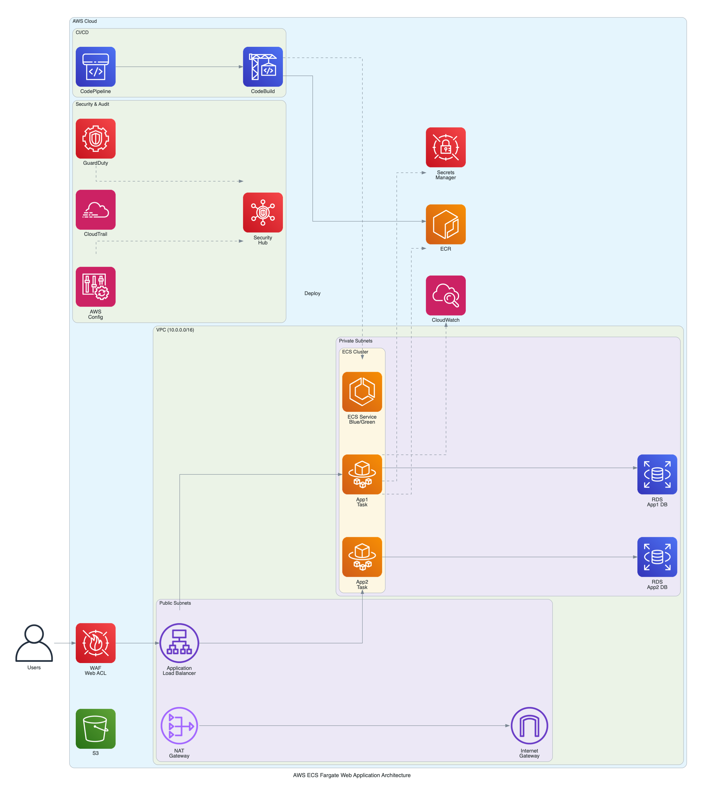
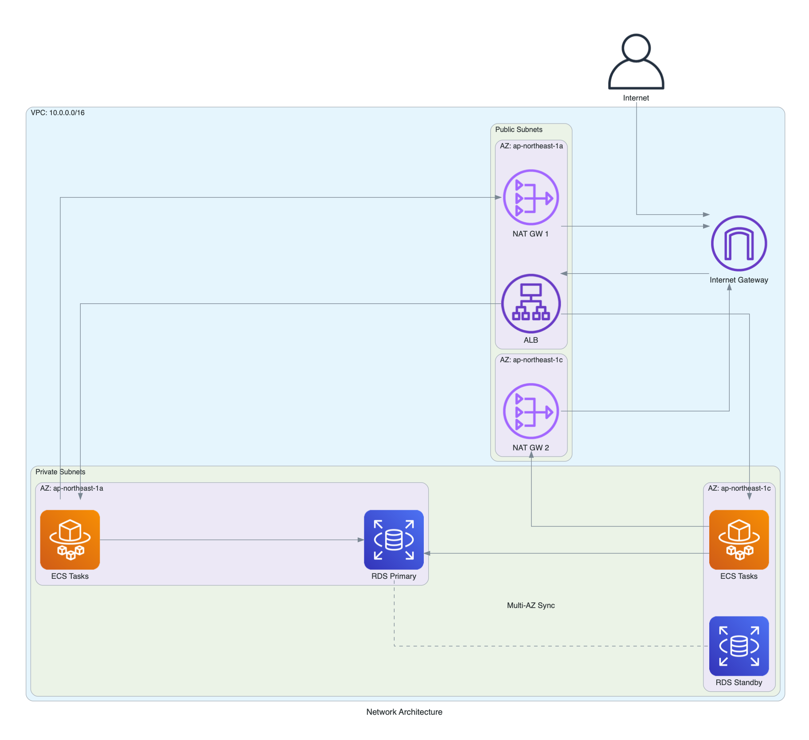
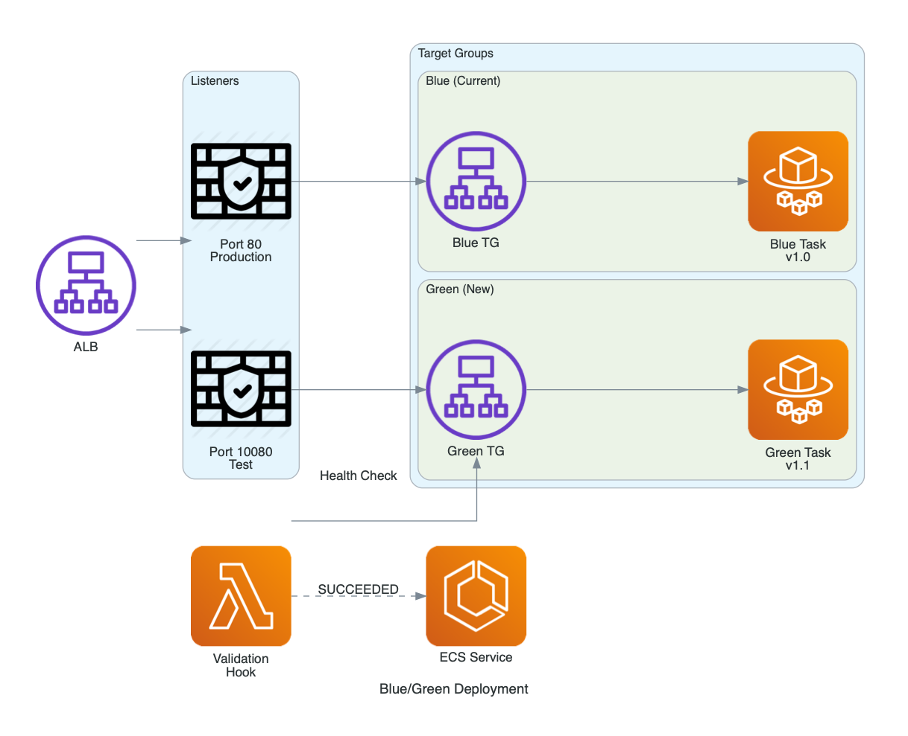
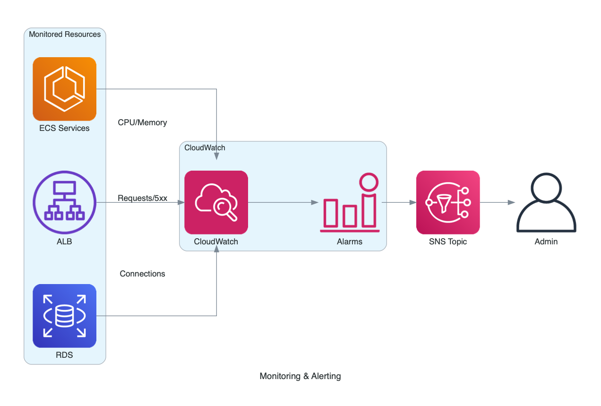

# アーキテクチャ図 (Architecture Diagrams)

本ディレクトリには、AWS ECS Fargate Webアプリケーション基盤のアーキテクチャ図を整理している。

---

## 目次

1. [図の一覧](#図の一覧)
2. [図の再生成方法](#図の再生成方法)
3. [参考リンク](#参考リンク)

---

## 図の一覧

### 1. 全体アーキテクチャ


### 2. ネットワーク構成


### 3. Blue/Green デプロイメント


### 4. CI/CD パイプライン


### 5. 監視・アラート


---

## 図の再生成方法

Python の [Diagrams](https://diagrams.mingrammer.com/) ライブラリを使用して生成。

### 前提条件

```bash
# Diagrams ライブラリをインストール
pip3 install diagrams

# Graphviz が必要（Mac）
brew install graphviz
```

### 再生成

```bash
python3 docs/generate_architecture.py
```

### 出力先

```
docs/images/
├── aws_ecs_architecture.png
├── network_architecture.png
├── bluegreen_deployment.png
├── cicd_pipeline.png
└── monitoring.png
```

---

## 参考リンク

- [Diagrams 公式ドキュメント](https://diagrams.mingrammer.com/)
- [AWS アイコン一覧](https://diagrams.mingrammer.com/docs/nodes/aws)
