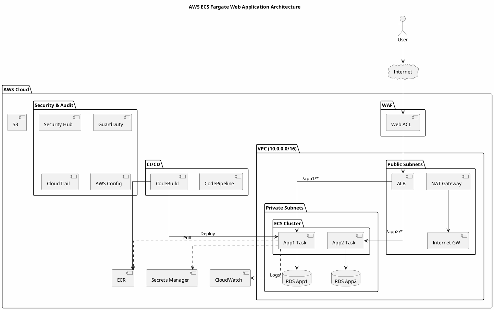
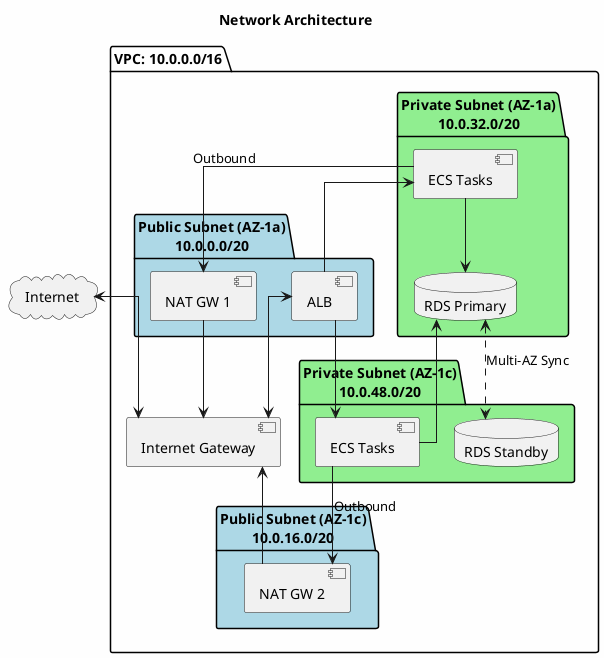
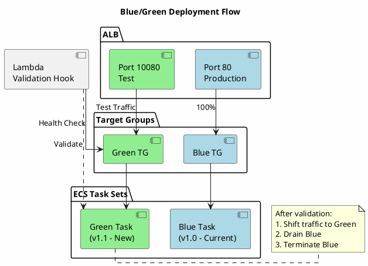
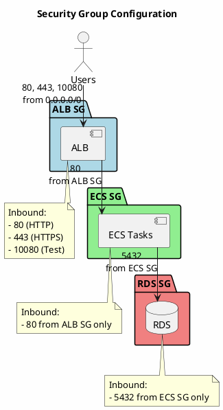
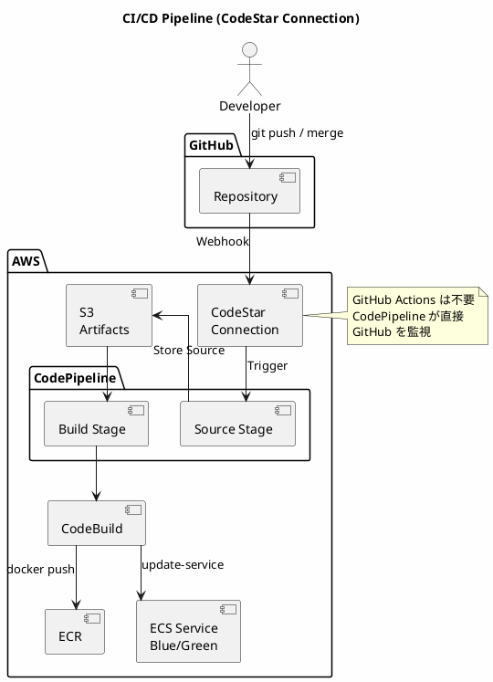
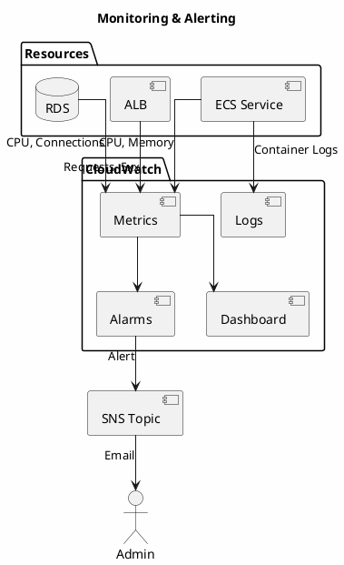

# アーキテクチャ図 - PlantUML版 (Architecture Diagram - PlantUML)

本ドキュメントでは、AWS ECS Fargate Webアプリケーション基盤のアーキテクチャを PlantUML + AWS公式アイコンで記述。

---

## 目次

1. [PlantUML の表示方法](#plantuml-の表示方法)
2. [全体アーキテクチャ（シンプル版）](#1-全体アーキテクチャシンプル版)
3. [ネットワーク構成](#2-ネットワーク構成)
4. [Blue/Green デプロイメント](#3-bluegreen-デプロイメント)
5. [セキュリティグループ](#4-セキュリティグループ)
6. [CI/CD パイプライン](#5-cicd-パイプライン)
7. [監視・アラート](#6-監視・アラート)
8. [PNG への変換方法](#png-への変換方法)
9. [参考リンク](#参考リンク)

---

## PlantUML の表示方法

### 推奨: オンラインサーバーを使用

VS Code の設定で以下を追加（`Cmd + ,` → 右上の「設定(JSON)を開く」）：

```json
{
    "plantuml.server": "https://www.plantuml.com/plantuml",
    "plantuml.render": "PlantUMLServer"
}
```

その後、コードブロック内にカーソルを置いて `Option + D` でプレビュー可能。

---

## 1. 全体アーキテクチャ（シンプル版）



---

## 2. ネットワーク構成



---

## 3. Blue/Green デプロイメント



---

## 4. セキュリティグループ



---

## 5. CI/CD パイプライン



---

## 6. 監視・アラート



---

## PNG への変換方法

### VS Code で変換

1. PlantUML 拡張機能をインストール
2. 設定でオンラインサーバーを有効化（上記参照）
3. コードブロック内にカーソルを置いて `Option + D` でプレビュー
4. `Cmd + Shift + P` → "PlantUML: Export Current Diagram"

### オンラインで変換

1. [PlantUML Server](https://www.plantuml.com/plantuml/uml/) にアクセス
2. コードを貼り付け
3. 生成された画像をダウンロード

---

## 参考リンク

- [AWS Icons for PlantUML (公式)](https://github.com/awslabs/aws-icons-for-plantuml)
- [PlantUML 公式サイト](https://plantuml.com/)
- [AWS Architecture Icons (公式)](https://aws.amazon.com/architecture/icons/)
