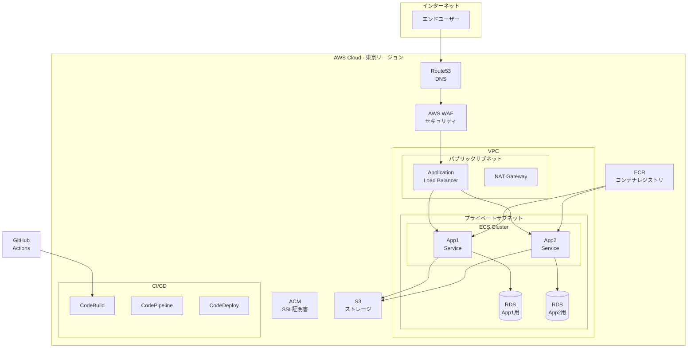
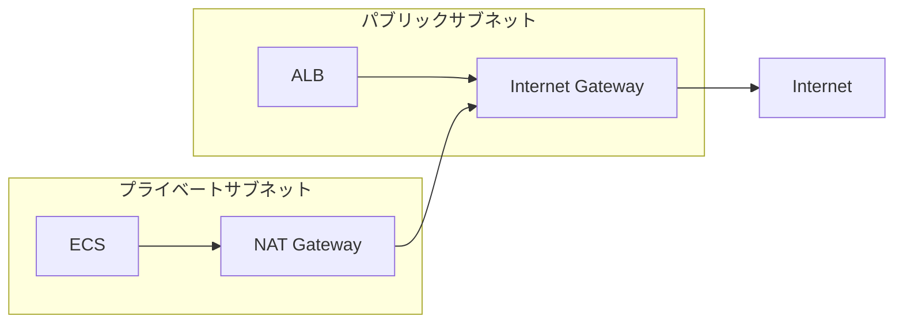
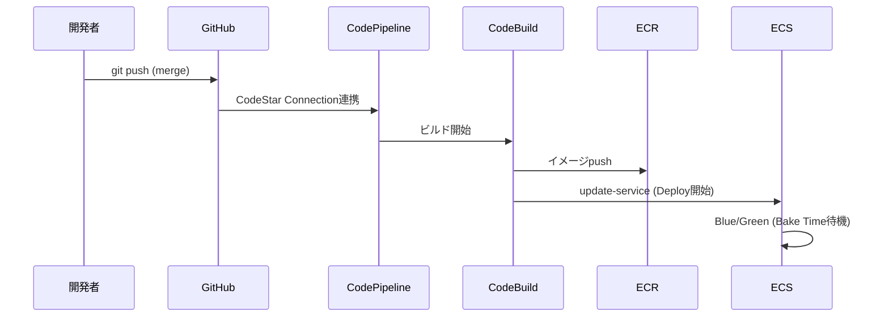

# AWS ECS Fargate Webアプリケーション基盤 基本設計書

---

## 目次

1. [ドキュメント概要](#1-ドキュメント概要)
2. [システム概要](#2-システム概要)
3. [機能要件](#3-機能要件)
4. [非機能要件](#4-非機能要件)
5. [ネットワーク設計](#5-ネットワーク設計)
6. [デプロイメント設計](#6-デプロイメント設計)
7. [運用設計](#7-運用設計)
8. [関連ドキュメント](#8-関連ドキュメント)

---

## 1. ドキュメント概要

| 項目 | 内容 |
|-----|------|
| プロジェクト名 | ECS Web Application |
| 作成日 | 2026-01-05 |
| 更新日 | 2026-01-05 |
| バージョン | 1.0 |

---

## 2. システム概要

### 2.1 目的

AWS ECS Fargateを使用したWebアプリケーション基盤を構築し、開発・ステージング・本番の3環境で運用可能なインフラストラクチャを提供する。

### 2.2 システム構成概要

### 2.3 前提条件・制約

| 項目 | 内容 |
|-----|------|
| クラウド | AWS |
| リージョン | ap-northeast-1 (東京) |
| IaC | Terraform |
| コンテナ | Docker / ECS Fargate |
| データベース | PostgreSQL (RDS) |
| アカウント構成 | 単一アカウント (論理分離) / マルチアカウント対応 |
| ドメイン | 未定（後日設定） |

---

## 3. 機能要件

### 3.1 アプリケーション構成

| アプリ | パス | 用途 |
|-------|-----|------|
| App1 | `/app1/*` | アプリケーション1 |
| App2 | `/app2/*` | アプリケーション2 |

### 3.2 環境構成

| 環境 | 用途 | デプロイ方法 |
|-----|------|-------------|
| dev | 開発環境 | developブランチpushで自動 |
| stg | ステージング環境 | stagingブランチpushで自動 |
| prd | 本番環境 | 手動発火 |

---

## 4. 非機能要件

### 4.1 可用性

| 項目 | dev/stg | prd |
|-----|---------|-----|
| SLA目標 | - | 99.9% |
| マルチAZ | No | Yes |
| ECSタスク数 | 1 | 2以上 |
| RDSマルチAZ | No | Yes |

### 4.2 性能

| 項目 | 値 |
|-----|-----|
| ECS CPU | 256 (dev/stg), 512 (prd) |
| ECS Memory | 512MB (dev/stg), 1024MB (prd) |
| RDSインスタンス | db.t4g.micro (dev/stg), db.t4g.medium (prd) |
| Auto Scaling | 最大10タスク (prd) |

### 4.3 セキュリティ

| 項目 | 対策 |
|-----|------|
| 通信暗号化 | HTTPS (ACM証明書) |
| WAF | AWSマネージドルール適用 |
| ネットワーク | プライベートサブネットでECS/RDS配置 |
| データ暗号化 | RDS/S3暗号化有効 |
| アクセス制御 | セキュリティグループで最小権限 |
| 脅威検知 | Amazon GuardDuty |
| セキュリティ監視 | AWS Security Hub (CISベンチマーク) |
| 構成監査 | AWS Config |
| API監査ログ | AWS CloudTrail (全リージョン) |

### 4.4 コスト最適化

| 環境 | 施策 |
|-----|------|
| dev/stg | Fargate Spot使用、NAT Gateway削減、VPC Endpoints活用 |
| prd | 通常Fargate、高可用性優先 |

---

## 5. ネットワーク設計

### 5.1 VPC構成

| 環境 | VPC CIDR |
|-----|----------|
| dev | 10.0.0.0/16 |
| stg | 10.1.0.0/16 |
| prd | 10.2.0.0/16 |

### 5.2 サブネット構成

| サブネット | 用途 | CIDR例 (dev) |
|-----------|------|-------------|
| public-1a | ALB, NAT Gateway | 10.0.0.0/20 |
| public-1c | ALB, NAT Gateway | 10.0.16.0/20 |
| private-1a | ECS, RDS | 10.0.32.0/20 |
| private-1c | ECS, RDS | 10.0.48.0/20 |

### 5.3 ルーティング

---

## 6. デプロイメント設計

| 項目 | 方式 |
|-----|------|
| デプロイタイプ | ECS組み込みBlue/Green (AWS Provider v6.x) |
| デプロイツール | Terraform / ECS |
| 検証 | ライフサイクルフック (Lambda) |
| ロールバック | 自動（失敗時・検証NG時） |

### 6.2 CI/CDフロー

---

## 7. 運用設計

### 7.1 監視（今後実装予定）

| 対象 | 監視項目 |
|-----|---------|
| ECS | CPU使用率、メモリ使用率、タスク数 |
| ALB | リクエスト数、レイテンシ、エラー率 |
| RDS | CPU、接続数、ストレージ |

### 7.2 アラート（今後実装予定）

| 重要度 | 条件 |
|-------|------|
| Critical | サービスダウン |
| Warning | 高負荷、エラー率上昇 |
| Info | デプロイ完了 |

### 7.3 バックアップ

| 対象 | 方式 | 保持期間 |
|-----|------|---------|
| RDS | 自動スナップショット | dev: 3日, stg: 7日, prd: 14日 |
| S3 | バージョニング | 無期限 |
| tfstate | S3バージョニング | 無期限 |

---

## 8. 関連ドキュメント

| ドキュメント | 内容 |
|------------|------|
| [Terraform コマンド集](terraform_commands.md) | Terraformコマンドの解説と使用例 |
| [Cognito 導入リファレンス](cognito_reference.md) | 認証基盤導入の参考構成 |
| 詳細設計書 | 各コンポーネントの詳細仕様 |
| README.md | セットアップ手順、運用手順 |
