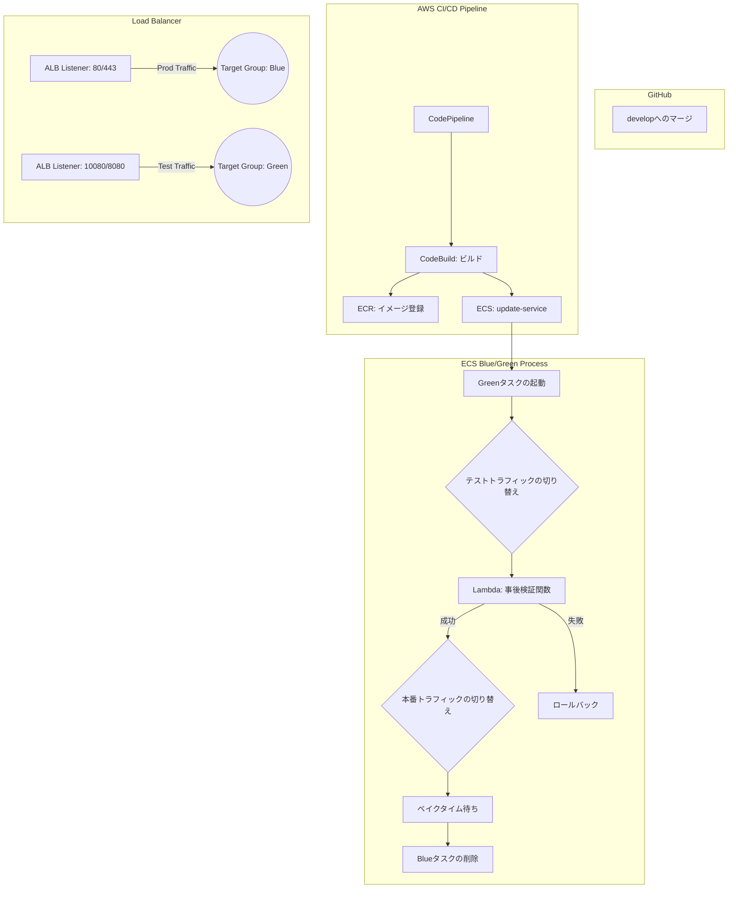

# ECS Blue/Green デプロイメント詳細ドキュメント

このドキュメントでは、本プロジェクトで採用している **AWS CodeDeployを使用しない「ECS組み込み型」Blue/Greenデプロイメント** の仕組みと、GitHubへのマージから切り替わり完了までの流れを詳しく解説する。

---

## 目次

1. [全体構成図](#1-全体構成図)
2. [デプロイのサイクル（フェーズ別解説）](#2-デプロイのサイクルフェーズ別解説)
3. [従来のデプロイ方式（CodeDeploy）との違い](#3-従来のデプロイ方式codedeployとの違い)
4. [よくある質問とトラブルシューティング](#4-よくある質問とトラブルシューティング)

---

## 1. 全体構成図

本プロジェクトのCI/CDおよびデプロイメントの全体像は以下の通り。

---

## 2. デプロイのサイクル（フェーズ別解説）

### フェーズ1：GitHubマージ 〜 CI/CDの起動
1.  **GitHubマージ**: 開発者がコードを `develop` ブランチにプッシュまたはマージ。
2.  **CodePipeline起動**: GitHubの変更を検知してCodePipelineが自動的に起動。
3.  **Build処理**: `CodeBuild` 内でDockerイメージがビルドされ、`ECR` にプッシュされる。
4.  **デプロイ実行**: CodeBuildの最後で `aws ecs update-service` コマンドが実行され、ECSサービスに新しいタスク定義が適用。

### フェーズ2：ECS組み込み型 Blue/Green の開始
ここからはAWSが自動的に以下のステップを実行。

1.  **Green環境の構築**:
    新しいタスク定義に基づいたタスク（Green）を、予備のターゲットグループ（通常はGreen用）に対して起動。
2.  **テストトラフィックの切り替え**:
    ALBの**テスト用リスナー**（例：ポート10080など）の向きが、Green環境のターゲットグループに自動で切り替わる。これにより、外部からは影響なく、内部的に新環境の動作確認が可能となる。

### フェーズ3：ライフサイクルフック（Lambdaによる検証）
本プロジェクトでは `POST_TEST_TRAFFIC_SHIFT` というタイミングでLambda（`validation_hook.py`）が実行される。

#### Lambdaは誰が実行（トリガー）するのか？
このLambdaを起動するのは、**「AWS ECSサービス（スケジューラー）」**自身である。

通常、Lambdaは何かのファイルが届いたり時間が来たりして動くが、この場合はデプロイの流れの中に組み込まれている：
1. **ECS**が「テスト用通信を新環境に繋いだぞ」と判断する。
2. **ECS**が設定（Terraformで指定した `hook_target_arn`）を見て、直接そのLambdaを**呼び出す（Invokeする）**。

#### なぜECSがLambdaを呼べるのか？
これにも専用の許可（**IAMロール：ecs_lifecycle_role**）が使用されている。ECSが「Lambdaを呼び出す権限」を持っており、デプロイが特定のステップに達した瞬間に、プログラムがプログラムを呼ぶ形で実行される。

つまり、人間が何かをしたりイベントを待ったりするのではなく、**デプロイ作業の「次の工程」としてECSが自動的にLambdaを呼び出す。**

#### Lambda（validation_hook.py）の具体的な処理内容
Lambda内部では以下のステップで厳密にチェックを行う。

1.  **環境変数の取得**: Terraformから渡された `VALIDATION_URL`（例: `http://alb-dns-name:10080/health`）を確認する。
2.  **HTTPリクエストの送信**: Green環境のみが繋がっているテスト用ポートに対して、実際にリクエストを送信する。
3.  **判定**:
    -   **200 OKが返ってきた場合**: 「新環境は正常にリクエストを処理できる」と判断し、ECSへ `SUCCEEDED`（成功）を返す。
    -   **エラー（404, 500等）やタイムアウトの場合**: 「新環境に不具合がある」と判断し、`FAILED`（失敗）を返す。
4.  **ECSの挙動**: `FAILED` を受け取ると、ECSは**本番ユーザーを切り替えることなくデプロイを中止**し、Greenタスクを破棄する。これにより、壊れたコードが本番にリリースされるのを自動的に防ぐ。

### フェーズ4：本番トラフィックの切り替え（運命の瞬間）

一般ユーザー（本番ポート：80/443）が新バージョン（Green）に切り替わるのは、**「Lambda検証が成功（SUCCEEDED）を返した数秒後」**である。

時系列での流れは以下の通り：

| ステップ | 状態 | ユーザー（本番） | 内部検証（テスト） |
| :--- | :--- | :--- | :--- |
| **1. ビルド完了** | Greenタスク起動 | 旧(Blue)を参照 | (起動待ち) |
| **2. テスト開始** | テストリスナーの重みがGreenへ | 旧(Blue)を参照 | **新(Green)を参照開始** |
| **3. Lambda実行** | `POST_TEST_TRAFFIC_SHIFT` | 旧(Blue)を参照 | **LambdaがGreenを叩く** |
| **4. 切り替え！** | **Lambdaが成功を返した瞬間** | **新(Green)へ自動切替** | 新(Green)を参照 |
| **5. ベイク** | 設定された待機時間（5分〜） | 新(Green)を参照 | 新(Green)を参照 |

#### 「切り替え」の際に何が起きているか？（誰が切り替えるのか）
ここが一番の核心である。切り替えを行うのは、**「AWS ECSサービス（管理システム）」**だ。

1.  **司令塔（ECS Service）**: Lambdaから「成功」の報告を受け取ると、ECSの管理システムが「切り替え指令」を出す。
2.  **実行犯（ALB）**: 指令を受けた**ALB（ロードバランサー）**が、瞬時にリスナールールの設定を書き換える。
    - 具体的には、ポート80の接続先を `ターゲットグループ：Blue` から `ターゲットグループ：Green` へと内部的にポインタを書き換える作業だ。

#### なぜECSが勝手にALBを操作できるのか？
Terraformの設定で、ECSに対して「ALBを操作しても良いよ」という強い権限（**IAMロール：ecs_infrastructure_role**）を与えているためだ。

- **役割**: ECS用の「インフラ操作権限」
- **許可されていること**: `elasticloadbalancing:ModifyRule`（ALBのルール書き換え）など

つまり、**「ECSという監督が、Lambdaという審判のOKサインを見て、ALBという装置のスイッチを切り替える」**という役割分担になっている。

#### 検証が終わると自動でグリーンが本番に昇格する
ご質問の「検証が終わり次第、グリーンがブルーに切り替わるか」という点だが、正確には**「検証が終わった瞬間に、グリーンが本番環境として昇格（プロダクション化）する」**というのが答え。
この瞬間に、これまでの「グリーン（新）」は、名実ともに「本番（メイン）」となる。

### フェーズ5：クリーンアップ
1.  **Blueタスクの削除**:
    ベイクタイムが無事に経過すると、旧環境（Blue）のタスクが正常に停止・削除され、デプロイが完了する。

---

## 3. 従来のデプロイ方式（CodeDeploy）との違い

本プロジェクトで採用している方式は、AWS CodeDeployという別サービスを仲介せず、**ECSサービスの機能だけで完結している**のが特徴。

| 特徴 | CodeDeploy方式 | ECS組み込み方式 (本プロジェクト) |
| :--- | :--- | :--- |
| **設定の複雑さ** | CodeDeployの設定が必要で複雑 | ECSサービスの設定だけで完結しシンプル |
| **デプロイ指示** | `appspec.json` が必要 | `aws ecs update-service` だけでOK |
| **コスト** | リソースが増えるため管理コスト高 | ECSリソースのみで管理が容易 |
| **柔軟性** | 非常に詳細な切り替え設定が可能 | 標準的なBlue/Greenには十分な機能 |

---

## 4. よくある質問とトラブルシューティング

-   **Q: 切り替わった瞬間にエラーが出たらどうなるか？**
    -   A: ベイクタイム中であれば、マネジメントコンソールから「ロールバック（以前の環境に戻す）」ボタン一つで戻せる。
-   **Q: なぜテスト用リスナーが必要なのか？**
    -   A: 本番トラフィックを流す前に、実際のALB＋Fargateという network構成で正常に起動しているかをLambdaで確実に確認するため。
-   **Q: DBの変更がある場合はどうすればよいか？**
    -   A: Blue/Greenデプロイはアプリ（タスク）の切り替えのみを管理。DBのマイグレーションはCodeBuildのステップ等で deployment 直前に実行する必要がある。

---
本ドキュメントに関する質問や、ベイクタイムの変更、Lambdaによる検証ロジックの強化などの要望があればプラットフォームチームへ相談。
