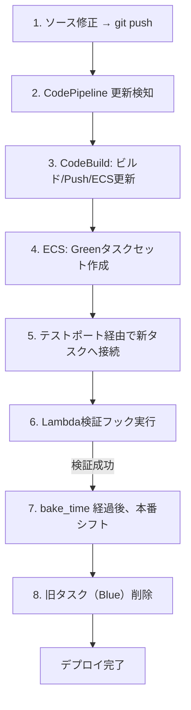

# デプロイ手順書 (Release Guide)

---

## 目次

1. [概要](#1-概要)
2. [前提条件](#2-前提条件)
3. [リソース依存関係](#3-リソース依存関係)
4. [初回構築手順 (Step-by-Step)](#4-初回構築手順-step-by-step)
5. [構築後の設定 (Post-Deployment)](#5-構築後の設定-post-deployment)
6. [継続的デプロイ (CI/CD) - Blue/Green デプロイメント](#6-継続的デプロイ-cicd---bluegreen-デプロイメント)
7. [トラブルシューティング](#8-トラブルシューティング)
8. [Blue/Green デプロイメントの確認方法](#9-bluegreen-デプロイメントの確認方法)
9. [環境削除手順](#10-環境削除手順)

---

## 1. 概要

本ドキュメントでは、AWS ECS Fargate Webアプリケーション基盤の新規構築およびデプロイ手順について記述する。
Terraformのリソース間依存関係を考慮し、`-target` オプションを使用した段階的なデプロイ手順をまとめている。

**本構成の特徴**:
- ECS組み込み Blue/Green デプロイメント対応
- Lambda ライフサイクルフックによるデプロイ検証
- CodePipeline/CodeBuild による CI/CD 自動化

---

## 2. 前提条件

### 2.1 必要なツール

| ツール | バージョン | 確認コマンド | 備考 |
|--------|----------|-------------|------|
| AWS CLI | 2.x 以上 | `aws --version` | |
| Terraform | 1.14.0 以上 | `terraform --version` | |
| Docker (Desktop) | 20.x 以上 | `docker --version` | **インストール・起動必須** |
| Git | 2.x 以上 | `git --version` | |

> [!CAUTION]
> Mac や Windows を使用している場合は、**Docker Desktop** を事前にインストールし、デプロイ作業前に起動しておく必要がある。Dockerが起動していないと、`docker pull` や `docker push` コマンドが失敗する。

### 2.2 AWS認証設定

```bash
# 基本設定
aws configure
# AWS Access Key ID, Secret Access Key, Default region name (ap-northeast-1), Default output format (json) を入力

# マルチアカウント/スイッチロールの場合
export AWS_PROFILE=my-profile

# 認証確認
aws sts get-caller-identity
```

### 2.3 環境変数の設定（推奨）

```bash
# AWSアカウントIDを取得して環境変数に設定
export AWS_ACCOUNT_ID=$(aws sts get-caller-identity --query Account --output text)
export AWS_REGION=ap-northeast-1
echo "AWS Account: $AWS_ACCOUNT_ID, Region: $AWS_REGION"
```

---

## 3. リソース依存関係

### 3.1 デプロイ順序

以下の順序でリソースを作成する必要がある：

```
1. Bootstrap (S3/DynamoDB)
    ↓
2. VPC/Subnet/Security Group
    ↓
3. ECR リポジトリ
    ↓
4. 初期Dockerイメージ Push
    ↓
5. S3 (アプリ用/CI/CD用/監査ログ用)
    ↓
6. RDS
    ↓
7. ALB/ターゲットグループ/リスナー/WAF
    ↓
8. ECS クラスター
    ↓
9. ECS サービス (Blue/Green設定含む)
    ↓
10. CI/CD (CodeBuild/CodePipeline)
    ↓
11. CloudWatch/AWS Backup
    ↓
12. セキュリティサービス (Security Hub, GuardDuty, Config, CloudTrail)
```

### 3.2 重要な依存関係

| 依存元 | 依存先 | 問題 | 対策 |
|--------|--------|------|------|
| ECS Service | ECR イメージ | イメージがないとタスク起動失敗 | ECR作成後に初期イメージをPush |
| ECS Service | ALB ターゲットグループ | ターゲットグループが必要 | ALBを先に作成 |
| ECS Service | RDS | DB接続情報が必要 | RDSを先に作成 |

---

## 4. 初回構築手順 (Step-by-Step)

### Step 1: 管理用リソースの作成 (Bootstrap)

tfstateファイルを管理するためのS3バケットとDynamoDBテーブルを作成する。

```bash
cd bootstrap
terraform init
terraform plan
terraform apply

# 出力を確認
terraform output
# 出力された tfstate_bucket_name をメモする
```

### Step 2: Backend設定の更新

各環境の `backend.tf` に、Step 1で作成されたバケット名を設定する。

```bash
# 編集対象
# - environments/dev/backend.tf
# - environments/stg/backend.tf
# - environments/prd/backend.tf

# 例: bucket = "ecs-web-app-tfstate-123456789012"
```

### Step 3: 変数ファイルの準備

```bash
cd ../environments/dev
cp terraform.tfvars.example terraform.tfvars

# terraform.tfvars を編集
# 注意: DBパスワードはSecrets Managerで自動生成されるため設定不要
```

### Step 4: Terraform 初期化

```bash
terraform init
```

**AWS Provider v6 以降の注意点**: AWS Provider のメジャーバージョンアップ（v5 → v6等）に伴い、一部の属性（例: `data.aws_region.current.name` → `id`）が非推奨となる場合がある。既存の環境で警告が出る場合は、以下のコマンドでプロバイダーを最新に同期すること。

```bash
# プロバイダーの強制アップデートと同期
terraform init -upgrade
```

**エラーが発生した場合**:
```bash
# バックエンドの再初期化
terraform init -reconfigure
```

### Step 5: VPC/セキュリティグループの作成

```bash
terraform apply -target=module.vpc -target=module.security_group
```

**確認コマンド**:
```bash
aws ec2 describe-vpcs --query 'Vpcs[*].[VpcId,Tags[?Key==`Name`].Value|[0]]' --output table
```

### Step 6: ECRリポジトリの作成

```bash
terraform apply -target=module.ecr_app1 -target=module.ecr_app2
```

**確認コマンド**:
```bash
aws ecr describe-repositories --query 'repositories[*].[repositoryName,repositoryUri]' --output table
```

### Step 7: 初期Dockerイメージの Push

ECSサービス起動にはECR上にイメージが存在している必要がある。Docker Desktop（またはDocker Engine）が起動していることを確認してから実行すること。

```bash
# ECRログイン
aws ecr get-login-password --region $AWS_REGION | docker login --username AWS --password-stdin $AWS_ACCOUNT_ID.dkr.ecr.$AWS_REGION.amazonaws.com

# 初期イメージ作成 (nginx:alpine を使用)
docker pull --platform linux/amd64 nginx:alpine
docker tag nginx:alpine $AWS_ACCOUNT_ID.dkr.ecr.$AWS_REGION.amazonaws.com/ecs-web-app/app1:latest
docker tag nginx:alpine $AWS_ACCOUNT_ID.dkr.ecr.$AWS_REGION.amazonaws.com/ecs-web-app/app2:latest

# Push
docker push $AWS_ACCOUNT_ID.dkr.ecr.$AWS_REGION.amazonaws.com/ecs-web-app/app1:latest
docker push $AWS_ACCOUNT_ID.dkr.ecr.$AWS_REGION.amazonaws.com/ecs-web-app/app2:latest
```

**確認コマンド**:
```bash
aws ecr describe-images --repository-name ecs-web-app/app1 --query 'imageDetails[*].[imageTags,imagePushedAt]' --output table
aws ecr describe-images --repository-name ecs-web-app/app2 --query 'imageDetails[*].[imageTags,imagePushedAt]' --output table
```

### Step 8: S3バケットの作成

```bash
terraform apply -target=module.s3_app -target=module.s3_artifacts -target=module.s3_audit_logs
```

### Step 9: RDSの作成

```bash
terraform apply -target=module.rds_app1 -target=module.rds_app2
```

> [!NOTE]
> RDS作成には10〜15分程度かかる。

**確認コマンド**:
```bash
aws rds describe-db-instances --query 'DBInstances[*].[DBInstanceIdentifier,DBInstanceStatus,Endpoint.Address]' --output table
```

### Step 10: ALB/WAF/ターゲットグループの作成

```bash
terraform apply -target=module.alb -target=module.waf
```

**確認コマンド**:
```bash
# ALB確認
aws elbv2 describe-load-balancers --query 'LoadBalancers[*].[LoadBalancerName,DNSName,State.Code]' --output table

# ターゲットグループ確認
aws elbv2 describe-target-groups --query 'TargetGroups[*].[TargetGroupName,TargetGroupArn]' --output table
```

### Step 11: ECSクラスターの作成

```bash
terraform apply -target=module.ecs_cluster
```

**確認コマンド**:
```bash
aws ecs list-clusters --output table
```

### Step 12: ECSサービスの作成

```bash
terraform apply -target=module.ecs_service_app1 -target=module.ecs_service_app2
```

> [!IMPORTANT]
> ECSサービスは Blue/Green デプロイメント設定で作成される。
> 初回作成時にヘルスチェックが通るまで数分かかる。

**確認コマンド**:
```bash
# サービス状態確認
aws ecs describe-services --cluster ecs-web-app-dev-cluster --services ecs-web-app-dev-app1 ecs-web-app-dev-app2 --query 'services[*].[serviceName,status,runningCount,desiredCount]' --output table

# デプロイ戦略確認
aws ecs describe-services --cluster ecs-web-app-dev-cluster --services ecs-web-app-dev-app1 --query 'services[0].deploymentConfiguration' --output json
```

```


### Step 13: CI/CDパイプラインの作成

```bash
terraform apply -target=module.cicd_app1 -target=module.cicd_app2
```

**確認コマンド**:
```bash
aws codepipeline list-pipelines --output table
```

### Step 14: CloudWatch/AWS Backupの作成

```bash
terraform apply -target=module.cloudwatch -target=module.backup
```

### Step 15: セキュリティサービスの作成

セキュリティ監視・脅威検知・監査ログのためのサービスを有効化する。

> [!IMPORTANT]
> セキュリティサービスは `s3_audit_logs` バケットに依存。
> Step 8 で `module.s3_audit_logs` が作成されていることを確認すること。

#### 15.1 前提条件の確認

```bash
# 監査ログ用S3バケットが作成されていることを確認
aws s3 ls | grep audit-logs
# 出力例: 2026-01-08 12:00:00 ecs-web-app-dev-audit-logs-123456789012
```

#### 15.2 CloudWatch Logsグループの作成（CloudTrail用）

```bash
# CloudTrail用ロググループが security.tf 内で定義されている
# 特別な操作は不要ですが、以下で事前確認可能
aws logs describe-log-groups --log-group-name-prefix /aws/cloudtrail/ecs-web-app
```

#### 15.3 セキュリティサービスの適用

```bash
# 全セキュリティモジュールを一括作成
terraform apply \
  -target=module.security_hub \
  -target=module.guardduty \
  -target=module.config \
  -target=aws_cloudwatch_log_group.cloudtrail \
  -target=module.cloudtrail
```

> [!NOTE]
> 初回適用時、Security Hub と GuardDuty の有効化に1〜2分程度かかることがある。

#### 15.4 環境別の設定ポイント

| 設定項目 | dev | stg | prd |
|---------|-----|-----|-----|
| CIS Benchmark | `false` | `true` | `true` |
| CloudTrail S3データイベント | `false` | `false` | `true` |
| CloudWatch Logs保持期間 | 7日 | 90日 | 365日 |
| force_destroy (S3) | `true` | `true` | `false` |

#### 15.5 Security Hubの確認

```bash
# Security Hubの有効化状態
aws securityhub describe-hub --query 'HubArn' --output text

# 有効化されている標準の確認
aws securityhub get-enabled-standards --query 'StandardsSubscriptions[*].[StandardsArn,StandardsStatus]' --output table

# セキュリティスコア概要（有効化後数分経過が必要）
aws securityhub get-findings-statistics --group-by-attribute SeverityLabel \
  --query 'GroupByKey | keys(@)' --output text
```

#### 15.6 GuardDutyの確認

```bash
# 検出器IDの取得
DETECTOR_ID=$(aws guardduty list-detectors --query 'DetectorIds[0]' --output text)
echo "Detector ID: $DETECTOR_ID"

# 検出器の詳細確認
aws guardduty get-detector --detector-id $DETECTOR_ID \
  --query '[Status,FindingPublishingFrequency]' --output text

# 有効化された保護機能の確認
aws guardduty list-detector-features --detector-id $DETECTOR_ID \
  --query 'Features[*].[Name,Status]' --output table
```

#### 15.7 AWS Configの確認

```bash
# Config Recorderの状態確認
aws configservice describe-configuration-recorder-status \
  --query 'ConfigurationRecordersStatus[*].[name,recording,lastStatus]' --output table

# 配信チャネルの確認
aws configservice describe-delivery-channels \
  --query 'DeliveryChannels[*].[name,s3BucketName]' --output table

# 記録対象リソースの確認
aws configservice describe-configuration-recorders \
  --query 'ConfigurationRecorders[*].recordingGroup' --output json
```

#### 15.8 CloudTrailの確認

```bash
# CloudTrailの一覧と設定確認
aws cloudtrail describe-trails \
  --query 'trailList[*].[Name,IsMultiRegionTrail,S3BucketName,CloudWatchLogsLogGroupArn]' \
  --output table

# 証跡のステータス確認
TRAIL_NAME="ecs-web-app-${ENV}-trail"
aws cloudtrail get-trail-status --name $TRAIL_NAME \
  --query '[IsLogging,LatestDeliveryTime]' --output text

# CloudWatch Logsグループの確認
aws logs describe-log-groups \
  --log-group-name-prefix /aws/cloudtrail/ecs-web-app-${ENV} \
  --query 'logGroups[*].[logGroupName,retentionInDays]' --output table
```

#### 15.9 統合確認（全サービス）

```bash
echo "=== Security Services Status ==="

echo ""
echo "--- Security Hub ---"
aws securityhub describe-hub --query 'HubArn' --output text 2>/dev/null \
  && echo "Status: ENABLED" || echo "Status: NOT ENABLED"

echo ""
echo "--- GuardDuty ---"
aws guardduty list-detectors --query 'DetectorIds[0]' --output text 2>/dev/null \
  && echo "Status: ENABLED" || echo "Status: NOT ENABLED"

echo ""
echo "--- AWS Config ---"
aws configservice describe-configuration-recorder-status \
  --query 'ConfigurationRecordersStatus[0].recording' --output text 2>/dev/null \
  && echo "Status: RECORDING" || echo "Status: NOT RECORDING"

echo ""
echo "--- CloudTrail ---"
aws cloudtrail describe-trails --query 'trailList[0].Name' --output text 2>/dev/null \
  && echo "Status: CONFIGURED" || echo "Status: NOT CONFIGURED"
```

### Step 16: 最終確認と残りのリソース

```bash
# 差分確認
terraform plan

# 残りのリソースがあれば適用
terraform apply
```

### Step 17: 動作確認

```bash
# ALB DNS名を取得
ALB_DNS=$(terraform output -raw alb_dns_name)
echo "ALB DNS: $ALB_DNS"

# アプリケーションにアクセス
curl -s http://$ALB_DNS/app1/ | grep h1
curl -s http://$ALB_DNS/app2/ | grep h1

# テストリスナー経由でアクセス
curl -s http://$ALB_DNS:10080/app1/ | grep h1
curl -s http://$ALB_DNS:10080/app2/ | grep h1
```

---

## 5. 構築後の設定 (Post-Deployment)

### 5.1 ドメインとSSL証明書（HTTPS化）

1. AWS Certificate Manager (ACM) でSSL証明書を発行
2. `terraform.tfvars` に証明書ARNを設定:
   ```hcl
   certificate_arn = "arn:aws:acm:ap-northeast-1:..."
   ```
3. `terraform apply` を再実行

### 5.2 DNSレコード設定

Route53等でALBのDNS名をCNAMEレコードとして登録する。

```bash
# ALB DNS名を確認
terraform output alb_dns_name
```

### 5.3 アラート通知設定

 CloudWatchアラームの通知先としてSNSトピックが作成されている。
AWSコンソールから、サブスクリプション（Email等）を追加すること。

### 5.4 GitHub Actions OIDC認証の設定

GitHub ActionsからAWSリソースにアクセスするためのOIDC認証を設定する。

> [!IMPORTANT]
> この設定が完了していない場合、GitHub Actionsワークフローは以下のエラーで失敗します：
> `Credentials could not be loaded, please check your action inputs: Could not load credentials from any providers`

#### 5.4.1 Terraformで作成（推奨）

`bootstrap/main.tf` にOIDCプロバイダーとIAMロールが定義されている。

```bash
cd bootstrap
terraform init
terraform plan
terraform apply
```

**作成されるリソース：**
- GitHub OIDC プロバイダー
- IAMロール（dev環境用）: `github-actions-ecs-web-app-dev`
- IAMロール（stg環境用）: `github-actions-ecs-web-app-stg`
- IAMロール（prd環境用）: `github-actions-ecs-web-app-prd`

**出力されるARNを確認：**
```bash
terraform output github_actions_role_arn_dev
terraform output github_actions_role_arn_stg
terraform output github_actions_role_arn_prd
```

> [!TIP]
> 出力されたARNを GitHub Secrets に設定すること（5.4.3参照）

#### 5.4.2 手動で作成（オプション）

Terraformを使わない場合は、以下の手順で手動作成も可能。

**AWSコンソールで実行：**
1. **IAM** → **Identity providers** → **Add provider**
2. 以下の設定：
   - Provider type: `OpenID Connect`
   - Provider URL: `https://token.actions.githubusercontent.com`
   - Audience: `sts.amazonaws.com`
3. **Add provider** をクリック

**または、AWS CLIで実行：**
```bash
aws iam create-open-id-connect-provider \
  --url https://token.actions.githubusercontent.com \
  --client-id-list sts.amazonaws.com \
  --thumbprint-list 6938fd4d98bab03faadb97b34396831e3780aea1
```

#### 5.4.2 IAMロールの作成（環境ごと）

各環境（dev, stg, prd）ごとにIAMロールを作成する。

**信頼ポリシー（Trust Policy）**：
```json
{
  "Version": "2012-10-17",
  "Statement": [
    {
      "Effect": "Allow",
      "Principal": {
        "Federated": "arn:aws:iam::<ACCOUNT_ID>:oidc-provider/token.actions.githubusercontent.com"
      },
      "Action": "sts:AssumeRoleWithWebIdentity",
      "Condition": {
        "StringEquals": {
          "token.actions.githubusercontent.com:aud": "sts.amazonaws.com"
        },
        "StringLike": {
          "token.actions.githubusercontent.com:sub": "repo:your-github-user/aws-ecs-portfolio:ref:refs/heads/*"
        }
      }
    }
  ]
}
```

**権限ポリシー**：
- `AdministratorAccess`（テスト用）または
- カスタムポリシー（本番用、最小権限）

AWS CLIでのロール作成例：
```bash
# 信頼ポリシーをファイルに保存
cat > trust-policy.json << 'EOF'
{
  "Version": "2012-10-17",
  "Statement": [
    {
      "Effect": "Allow",
      "Principal": {
        "Federated": "arn:aws:iam::YOUR_ACCOUNT_ID:oidc-provider/token.actions.githubusercontent.com"
      },
      "Action": "sts:AssumeRoleWithWebIdentity",
      "Condition": {
        "StringEquals": {
          "token.actions.githubusercontent.com:aud": "sts.amazonaws.com"
        },
        "StringLike": {
          "token.actions.githubusercontent.com:sub": "repo:your-github-user/aws-ecs-portfolio:*"
        }
      }
    }
  ]
}
EOF

# YOUR_ACCOUNT_ID を実際の値に置換
sed -i '' "s/YOUR_ACCOUNT_ID/$(aws sts get-caller-identity --query Account --output text)/" trust-policy.json

# dev環境用ロールを作成
aws iam create-role \
  --role-name github-actions-ecs-web-app-dev \
  --assume-role-policy-document file://trust-policy.json

# 権限ポリシーをアタッチ
aws iam attach-role-policy \
  --role-name github-actions-ecs-web-app-dev \
  --policy-arn arn:aws:iam::aws:policy/AdministratorAccess

# stg, prd も同様に作成（ロール名を変更）
```

#### 5.4.3 GitHub Secrets の設定

リポジトリの **Settings** → **Secrets and variables** → **Actions** → **New repository secret** で以下を設定：

| シークレット名 | 値 | 説明 |
|--------------|---|------|
| `AWS_ROLE_ARN_DEV` | `arn:aws:iam::123456789012:role/github-actions-ecs-web-app-dev` | dev環境用IAMロールARN |
| `AWS_ROLE_ARN_STG` | `arn:aws:iam::123456789012:role/github-actions-ecs-web-app-stg` | stg環境用IAMロールARN |
| `AWS_ROLE_ARN_PRD` | `arn:aws:iam::123456789012:role/github-actions-ecs-web-app-prd` | prd環境用IAMロールARN |
| `DB_PASSWORD_APP1_DEV` | (任意) | ※Secrets Manager使用時は空文字可 |
| `DB_PASSWORD_APP2_DEV` | (任意) | ※Secrets Manager使用時は空文字可 |
| `DB_PASSWORD_APP1_STG` | (任意) | ※Secrets Manager使用時は空文字可 |
| `DB_PASSWORD_APP2_STG` | (任意) | ※Secrets Manager使用時は空文字可 |

#### 5.4.4 設定確認

GitHub Actionsワークフローを手動実行して確認：
1. リポジトリの **Actions** タブを開く
2. 対象のワークフローを選択
3. **Run workflow** → ブランチを選択して実行
4. 「Configure AWS Credentials」ステップが成功することを確認

---

## 6. 継続的デプロイ (CI/CD) - Blue/Green デプロイメント

### 6.1 デプロイフロー



### 6.2 主要コンポーネント

| コンポーネント | 役割 |
|---------------|------|
| **Blue ターゲットグループ** | 本番トラフィックを受ける現行タスク用 (`*-tg`) |
| **Green ターゲットグループ** | 新規デプロイタスク用 (`*-tg-green`) |
| **本番リスナー (ポート 80)** | 本番トラフィックをルーティング |
| **テストリスナー (ポート 10080)** | 検証用トラフィックをルーティング |
| **Lambda 検証フック** | 新タスクのヘルスチェックを実行 |

### 6.3 環境ごとの対象ブランチ

| 環境 | ブランチ | 自動デプロイ |
|------|---------|-------------|
| dev | `develop` | ✅ |
| stg | `staging` | ✅ |
| prd | `production` | 手動 （自動トリガーOFF） |

### 6.4 本番環境 (prd) のデプロイ方法

本番環境のパイプラインは、誤操作防止のため **GitHubへのプッシュによる自動トリガーが無効化** されている。
デプロイを行うには、AWSマネジメントコンソールまたはAWS CLIから手動でパイプラインを開始する必要がある。

#### 手順 (AWS CLI)

```bash
# 環境変数の設定
export ENV=prd
export AWS_ACCOUNT_ID=$(aws sts get-caller-identity --query Account --output text)

# パイプラインの手動実行 (最新のソースコードを取得して開始)
aws codepipeline start-pipeline-execution --name ecs-web-app-${ENV}-app1-pipeline
aws codepipeline start-pipeline-execution --name ecs-web-app-${ENV}-app2-pipeline

# 状態確認
aws codepipeline get-pipeline-state --name ecs-web-app-${ENV}-app1-pipeline --query 'stageStates[*].{Stage:stageName,Status:latestExecution.status}' --output table
```

#### 手順 (AWS コンソール)
1. AWSコンソールで **CodePipeline** を開く。
2. 対象のパイプライン (`ecs-web-app-prd-app1-pipeline` 等) を選択。
3. **「変更をリリースする (Release change)」** ボタンをクリック。

### 6.5 AWS Backupの確認

バックアップが正しく設定されているか確認する：

```bash
# バックアッププラン一覧
aws backup list-backup-plans --query 'BackupPlansList[*].[BackupPlanName,BackupPlanId]' --output table

# バックアップボルト一覧
aws backup list-backup-vaults --query 'BackupVaultList[*].[BackupVaultName,NumberOfRecoveryPoints]' --output table

# RDSバックアップジョブの確認
aws backup list-backup-jobs \
  --by-resource-type RDS \
  --query 'BackupJobs[*].[ResourceArn,State,CreationDate]' \
  --output table

# S3バックアップジョブの確認
aws backup list-backup-jobs \
  --by-resource-type S3 \
  --query 'BackupJobs[*].[ResourceArn,State,CreationDate]' \
  --output table
```

---

## 7. 構築後の設定 (Post-Deployment)

### 7.1 HTTPS化 (ACM証明書の設定)

本番環境 (prd) ではHTTPSが必須となる場合がある。初回構築時はHTTPのみで構築し、後からHTTPSを有効化することを推奨する。

#### 手順

1. **ドメインの取得とACM証明書の作成**
   - AWSコンソールまたはTerraformでACM証明書を作成し、DNS検証を完了させること。
   - `arn:aws:acm:ap-northeast-1:ACCOUNT_ID:certificate/UUID` 形式のARNを取得。

2. **variables.tf / terraform.tfvars の更新**
   - `environments/prd/terraform.tfvars` を編集し、`certificate_arn` を設定。

```hcl
# HTTPSを有効化
certificate_arn = "arn:aws:acm:ap-northeast-1:123456789012:certificate/xxxxxxxx-xxxx-xxxx-xxxx-xxxxxxxxxxxx"
```

3. **Terraform Apply**
   HTTPSリスナーとリダイレクト設定が追加される。

```bash
terraform plan
terraform apply
```

4. **DNSレコード (Route 53) の設定**
   - Route 53 でドメインのAレコード（エイリアス）を作成し、ALBのDNS名 (`module.alb.dns_name`) を指すように設定。

---

## 8. トラブルシューティング

### 8.1 よくあるエラーと対処法

| 症状 | 原因 | 対処法 |
|------|------|--------|
| **ECSサービス作成タイムアウト** | ECRにイメージがない | Step 7 の初期イメージPushを実行 |
| **503 Service Temporarily Unavailable** | ターゲットグループにHealthyなターゲットがない | 後述の「503エラー復旧手順」を参照 |
| **exec format error** | Dockerイメージのアーキテクチャ不一致 | `--platform linux/amd64` でビルド |
| **デプロイがロールバック** | Lambda検証フック失敗 | CloudWatch Logs確認 |
| **パイプラインが動かない** | S3ポーリング無効 | `PollForSourceChanges = true` 確認 |
| **Lambda戻り値エラー** | hookStatusが不正 | `SUCCEEDED` / `FAILED` のみ有効 |
| **State Lock エラー** | DynamoDBにロックが残存 | 後述の「8.10 State Lockの解除」を参照 |
| **OIDC認証エラー (sts:AssumeRoleWithWebIdentity)** | リポジトリ名変更によるIAM Trust Policy不一致 | `bootstrap/main.tf` の `github_repository` を修正し `terraform apply` |
| **CI/CDで変数未定義エラー** | `variables.tf` に変数定義が不足 | 必要な変数を追加しデフォルト値を設定 |

### 8.2 503エラー復旧手順

Blue/Green デプロイメント中、リスナールールとターゲットグループの不整合が発生することがある。

#### 8.2.1 原因の特定

```bash
# 1. 本番リスナーARNを取得
LISTENER_ARN=$(aws elbv2 describe-listeners --load-balancer-arn $(aws elbv2 describe-load-balancers --names ecs-web-app-dev-alb --query 'LoadBalancers[0].LoadBalancerArn' --output text) --query 'Listeners[?Port==`80`].ListenerArn' --output text)

# 2. ルールの確認
aws elbv2 describe-rules --listener-arn $LISTENER_ARN --query 'Rules[*].{Priority:Priority,TargetGroupArn:Actions[0].TargetGroupArn}' --output table

# 3. 各ターゲットグループのヘルス確認
aws elbv2 describe-target-health --target-group-arn <Blue TG ARN>
aws elbv2 describe-target-health --target-group-arn <Green TG ARN>
```

#### 8.2.2 復旧方法

Healthy なターゲットが存在する方のターゲットグループにリスナールールを向ける。

```bash
# ルールARNを取得
RULE_ARN=$(aws elbv2 describe-rules --listener-arn $LISTENER_ARN --query 'Rules[?Priority==`100`].RuleArn' --output text)

# Healthyなターゲットグループに向ける
aws elbv2 modify-rule --rule-arn $RULE_ARN --actions Type=forward,TargetGroupArn=<HealthyなTG ARN>
```

### 8.3 ECSサービスの状態確認

```bash
# イベントログ確認
aws ecs describe-services --cluster ecs-web-app-dev-cluster --services ecs-web-app-dev-app1 --query 'services[0].events[:10]' --output table

# デプロイ状態確認
aws ecs describe-services --cluster ecs-web-app-dev-cluster --services ecs-web-app-dev-app1 --query 'services[0].deployments' --output json

# タスク状態確認
aws ecs list-tasks --cluster ecs-web-app-dev-cluster --service-name ecs-web-app-dev-app1
```

### 8.4 Lambda検証フックのログ確認

```bash
# ロググループ確認
aws logs describe-log-groups --log-group-name-prefix /aws/lambda/ecs-web-app-dev

# 最新ログ確認
aws logs tail /aws/lambda/ecs-web-app-dev-app1-validation-hook --follow
```

### 8.5 Terraform状態のリセット（最終手段）

特定のリソースで問題が発生した場合：

```bash
# リソースをTerraform管理から除外
terraform state rm 'module.alb.aws_lb_listener_rule.app1_http[0]'

# リソースを再インポート
terraform import 'module.alb.aws_lb_listener_rule.app1_http[0]' <RULE_ARN>

# または taint して再作成
terraform taint 'module.alb.aws_lb_listener_rule.app1_http[0]'
terraform apply
```

### 8.6 タスク起動確認コマンド

ECSタスクが正常に起動しているか確認するためのコマンド集：

```bash
# ECSサービスの状態確認（runningCount/desiredCount）
aws ecs describe-services --cluster ecs-web-app-${ENV}-cluster \
  --services ecs-web-app-${ENV}-app1 ecs-web-app-${ENV}-app2 \
  --query 'services[*].[serviceName,runningCount,desiredCount]' \
  --output table --no-cli-pager

# ALBターゲットグループのヘルス確認
aws elbv2 describe-target-health \
  --target-group-arn $(aws elbv2 describe-target-groups --names ecs-web-app-${ENV}-app1-tg --query 'TargetGroups[0].TargetGroupArn' --output text) \
  --query 'TargetHealthDescriptions[*].[Target.Id,TargetHealth.State,TargetHealth.Reason]' \
  --output table --no-cli-pager

# ECSサービスの最新イベント確認
aws ecs describe-services --cluster ecs-web-app-${ENV}-cluster \
  --services ecs-web-app-${ENV}-app1 \
  --query 'services[0].events[0:5].[createdAt,message]' \
  --output table --no-cli-pager

# ALBへのアクセス確認
curl http://$(terraform output -raw alb_dns_name)/app1/
curl http://$(terraform output -raw alb_dns_name)/app2/
```

### 8.7 ポート設定の不一致（503エラー）

#### 症状
- curlで503 Service Temporarily Unavailable
- ターゲットグループでunhealthy状態

#### 原因
`terraform.tfvars` の `app_port` と実際のDockerイメージのリッスンポートが一致していない。
例: nginx:alpine はポート80でリッスンするが、app_port=8080 に設定されている。

#### 確認方法
```bash
# dev環境のポート設定を確認
aws ecs describe-task-definition --task-definition ecs-web-app-dev-app1 \
  --query 'taskDefinition.containerDefinitions[0].portMappings[0].containerPort' --output text

# stg環境のポート設定を確認
aws ecs describe-task-definition --task-definition ecs-web-app-stg-app1 \
  --query 'taskDefinition.containerDefinitions[0].portMappings[0].containerPort' --output text
```

#### 解決方法
`terraform.tfvars` を修正：
```hcl
# nginx:alpine を使用する場合
app_port          = 80
health_check_path = "/"
```

### 8.8 ターゲットグループ削除エラー（ResourceInUse）

#### 症状
```
Error: deleting ELBv2 Target Group: ResourceInUse: Target group is currently in use by a listener or a rule
```

#### 原因
ターゲットグループがリスナールールまたはECSサービスから参照されている状態でポート変更（再作成）しようとした。

#### 解決方法

**Step 1: ECSサービスを停止**
```bash
aws ecs update-service --cluster ecs-web-app-${ENV}-cluster \
  --service ecs-web-app-${ENV}-app1 --desired-count 0 --no-cli-pager

aws ecs update-service --cluster ecs-web-app-${ENV}-cluster \
  --service ecs-web-app-${ENV}-app2 --desired-count 0 --no-cli-pager

sleep 60
```

**Step 2: リスナールールを削除**
```bash
# HTTPリスナー（ポート80）のルールを確認
LISTENER_ARN=$(aws elbv2 describe-listeners \
  --load-balancer-arn $(aws elbv2 describe-load-balancers --names ecs-web-app-${ENV}-alb --query 'LoadBalancers[0].LoadBalancerArn' --output text) \
  --query 'Listeners[?Port==`80`].ListenerArn' --output text --no-cli-pager)

aws elbv2 describe-rules --listener-arn $LISTENER_ARN --query 'Rules[*].[Priority,RuleArn]' --output table --no-cli-pager

# デフォルト以外のルールを削除（ARNを確認して実行）
aws elbv2 delete-rule --rule-arn <RULE_ARN>

# テストリスナー（ポート10080）も同様に削除
TEST_LISTENER_ARN=$(aws elbv2 describe-listeners \
  --load-balancer-arn $(aws elbv2 describe-load-balancers --names ecs-web-app-${ENV}-alb --query 'LoadBalancers[0].LoadBalancerArn' --output text) \
  --query 'Listeners[?Port==`10080`].ListenerArn' --output text --no-cli-pager)

aws elbv2 describe-rules --listener-arn $TEST_LISTENER_ARN --query 'Rules[?Priority!=`default`].[RuleArn]' --output text --no-cli-pager | xargs -I {} aws elbv2 delete-rule --rule-arn {}
```

**Step 3: terraform apply を再実行**
```bash
terraform apply
```

**Step 4: ECSサービスを再起動**
```bash
aws ecs update-service --cluster ecs-web-app-${ENV}-cluster \
  --service ecs-web-app-${ENV}-app1 --desired-count 1 --no-cli-pager

aws ecs update-service --cluster ecs-web-app-${ENV}-cluster \
  --service ecs-web-app-${ENV}-app2 --desired-count 1 --no-cli-pager
```

### 8.9 ECSサービスの強制再作成

リスナールールの参照が壊れた場合、ECSサービスを再作成する必要がある。

#### 症状
```
deployment failed: Service deployment rolled back because of invalid networking configuration. 
One or more rules not found
```

#### 解決方法

**Step 1: Terraform状態からECSサービスを削除**
```bash
terraform state rm 'module.ecs_service_app1.aws_ecs_service.main'
terraform state rm 'module.ecs_service_app2.aws_ecs_service.main'
```

**Step 2: AWSからECSサービスを削除**
```bash
aws ecs delete-service --cluster ecs-web-app-${ENV}-cluster \
  --service ecs-web-app-${ENV}-app1 --force --no-cli-pager

aws ecs delete-service --cluster ecs-web-app-${ENV}-cluster \
  --service ecs-web-app-${ENV}-app2 --force --no-cli-pager

sleep 60
```

**Step 3: terraform apply でECSサービスを再作成**
```bash
terraform apply
```

> [!TIP]
> prd環境をデプロイする際は、`terraform.tfvars` で最初から `app_port = 80` と `health_check_path = "/"` を設定しておくことで、これらの問題を回避可能。

---

## 9. Blue/Green デプロイメントの確認方法

```bash
# デプロイ戦略の確認
aws ecs describe-services --cluster ecs-web-app-dev-cluster --services ecs-web-app-dev-app1 \
  --query 'services[0].deploymentConfiguration' --output json

# ロードバランサー設定の確認（advancedConfiguration含む）
aws ecs describe-services --cluster ecs-web-app-dev-cluster --services ecs-web-app-dev-app1 \
  --query 'services[0].loadBalancers' --output json

# テストリスナー経由でのアクセス（新タスクの確認）
curl http://$(terraform output -raw alb_dns_name):10080/app1/

# 本番リスナー経由でのアクセス
curl http://$(terraform output -raw alb_dns_name)/app1/
```

---

### 8.10 State Lockの解除

GitHub Actions や他の Terraform 実行が異常終了した場合、DynamoDB にロックが残り、後続の `plan`/`apply` がブロックされることがある。

#### 症状
```
Error: Error acquiring the state lock
Lock Info:
  ID:        xxxxxxxx-xxxx-xxxx-xxxx-xxxxxxxxxxxx
  Path:      ecs-web-app-tfstate-123456789012/dev/terraform.tfstate
```

#### 対処法

**方法1: Terraform コマンドで解除**
```bash
terraform force-unlock <LOCK_ID>
# 例: terraform force-unlock 9cfd313b-fd48-f91d-45ba-10c1943238b7
```

**方法2: AWS CLI で直接削除（確実）**
```bash
# dev環境のロック解除
aws dynamodb delete-item \
  --table-name ecs-web-app-tfstate-lock \
  --key '{"LockID": {"S": "ecs-web-app-tfstate-123456789012/dev/terraform.tfstate"}}' \
  --region ap-northeast-1

# stg環境のロック解除
aws dynamodb delete-item \
  --table-name ecs-web-app-tfstate-lock \
  --key '{"LockID": {"S": "ecs-web-app-tfstate-123456789012/stg/terraform.tfstate"}}' \
  --region ap-northeast-1

# prd環境のロック解除
aws dynamodb delete-item \
  --table-name ecs-web-app-tfstate-lock \
  --key '{"LockID": {"S": "ecs-web-app-tfstate-123456789012/prd/terraform.tfstate"}}' \
  --region ap-northeast-1
```

---

### 8.11 OIDC認証エラー (GitHub Actions)

リポジトリ名を変更した場合、GitHub Actions から AWS への認証が失敗する。

#### 症状
```
Error: Could not assume role with OIDC: Not authorized to perform sts:AssumeRoleWithWebIdentity
```

#### 原因
`bootstrap/main.tf` の `github_repository` 変数と、実際の GitHub リポジトリ名が一致していない。

#### 対処法
1. `bootstrap/main.tf` の `github_repository` 変数を正しいリポジトリ名に修正
2. Bootstrap ディレクトリで `terraform apply` を実行し、IAM ロールの Trust Policy を更新

```bash
cd bootstrap
# main.tf の github_repository を修正後
terraform apply
```

---

### 8.12 CI/CDでの変数未定義エラー

GitHub Actions で `terraform plan` 実行時に変数が見つからないエラーが発生する。

#### 症状
```
Error: Value for undeclared variable
A variable named "db_password_app1" was assigned on the command line, but the root module does not declare a variable of that name.
```

#### 対処法
該当環境の `variables.tf` に変数定義を追加する。CI/CD で値が渡されない場合にも動作するよう、`default = ""` を設定しておくことを推奨。

```hcl
variable "db_password_app1" {
  description = "App1のDBパスワード"
  type        = string
  sensitive   = true
  default     = ""
}
```

---

## 10. 環境削除手順

```bash
# 1. ECSサービスのdesiredCountを0にする（タスク停止）
aws ecs update-service --cluster ecs-web-app-dev-cluster --service ecs-web-app-dev-app1 --desired-count 0
aws ecs update-service --cluster ecs-web-app-dev-cluster --service ecs-web-app-dev-app2 --desired-count 0

# 2. タスク停止を待つ
sleep 60

# 3. Terraform destroy
terraform destroy

# 4. Bootstrap削除（最後に実行）
cd ../bootstrap
terraform destroy
```

> [!WARNING]
> 本番環境の削除は慎重に行うこと。RDSは `deletion_protection` が有効な場合がある。
